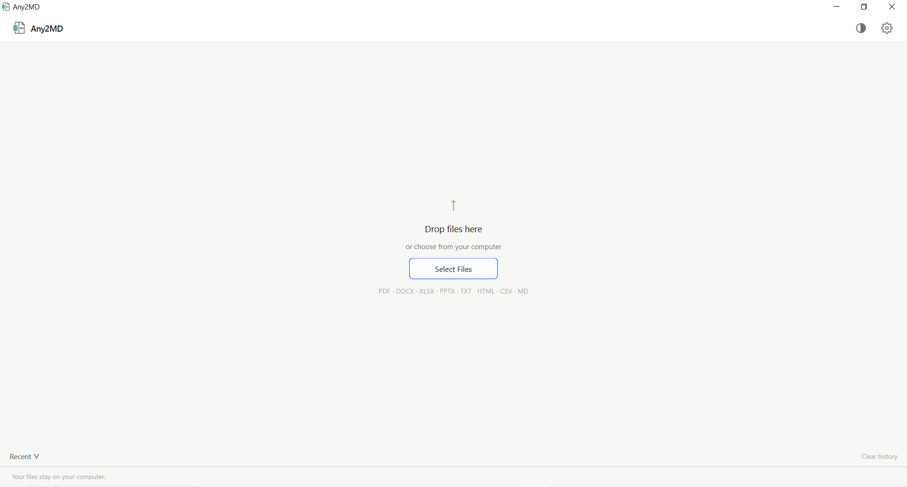

<p align="center">
  
</p>

<h1 align="center">Any2MD</h1>

<p align="center">
  <strong>Fast, beautiful, local-first Windows desktop application for converting common document formats to and from Markdown.</strong>
</p>

<p align="center">
  
  
  
  
  
  
</p>

---

## 📸 Application Preview

<p align="center">
  
</p>

> [!TIP]
> **Screenshot Upload Placeholder**: Save your application screenshot as `assets/screenshot.png` (or update the path above) to display it in the preview area.

---

## 📖 Overview

**Any2MD** is a modern desktop utility designed for developers, technical writers, researchers, and productivity enthusiasts who frequently work with Markdown and office documents. 

Unlike web-based converters, **all processing runs 100% locally on your machine**. Your sensitive files, presentations, spreadsheets, and confidential documents never leave your computer and no network connection is ever required.

---

## ✨ Key Features

- **🔄 Bidirectional Conversion**:
  - **Documents to Markdown**: Convert PDF, Word (`.docx`), Excel (`.xlsx`, `.xls`), PowerPoint (`.pptx`, `.ppt`), Plain Text (`.txt`), HTML (`.html`, `.htm`), and CSV (`.csv`) into clean, structured Markdown powered by **Microsoft MarkItDown**.
  - **Markdown to Documents**: Export Markdown files (`.md`) into professionally styled PDF (via **WeasyPrint**), formatted Word documents (`.docx`), or clean HTML.
- **⚡ Direct Two-Hop Pipeline**: Automatically convert non-Markdown files directly to other formats (e.g., PDF to Word, HTML to PDF) seamlessly behind the scenes without manual intermediate steps.
- **📁 Batch Processing**: Drag and drop dozens of files at once. Conversions run asynchronously on background worker threads with live, per-file progress tracking and cancellation support.
- **🪟 Windows Explorer Context Menu**: Convert files directly from the Windows right-click menu with tailored cascading options (e.g., *Right-click PDF > Convert with Any2MD > Markdown (.md)*). Operates via per-user registry (`HKCU`), requiring **zero administrator privileges**.
- **🎨 Modern Fluent-Inspired UI**: Clean, adaptive interface supporting **Dark**, **Light**, and **System** themes with automatic Windows registry color-scheme detection.
- **📜 Recent Files Drawer**: Easily track conversion history, open generated documents with a double-click, or reveal output files directly in Windows File Explorer.
- **🖥️ High-DPI Ready**: Crystal-clear rendering across standard (100%), 125%, 150%, and 200% Windows display scaling settings.
- **🔒 Private & Offline**: No cloud APIs, no telemetry, and zero external network calls.

---

## 📊 Supported Formats

| Input Format | File Extensions | Supported Target Outputs | Conversion Engine / Mechanism |
| :--- | :--- | :--- | :--- |
| **PDF Document** | `.pdf` | `.md`, `.docx`, `.html` | Microsoft MarkItDown *(+ Two-Hop pipeline)* |
| **Word Document** | `.docx` | `.md`, `.pdf`, `.html` | Microsoft MarkItDown *(+ Two-Hop pipeline)* |
| **Excel Spreadsheet** | `.xlsx`, `.xls` | `.md` | Microsoft MarkItDown |
| **PowerPoint Presentation** | `.pptx`, `.ppt` | `.md` | Microsoft MarkItDown |
| **Plain Text** | `.txt` | `.md`, `.docx`, `.pdf`, `.html` | Native UTF-8 parsing *(+ Two-Hop pipeline)* |
| **HTML Document** | `.html`, `.htm` | `.md`, `.docx`, `.pdf` | Microsoft MarkItDown *(+ Two-Hop pipeline)* |
| **CSV Table** | `.csv` | `.md` | Microsoft MarkItDown table generator |
| **Markdown Document** | `.md` | `.pdf`, `.docx`, `.html` | WeasyPrint, python-docx, Python-Markdown |

---

## 🚀 Getting Started

### Prerequisites

- **Windows 10** or **Windows 11** (64-bit recommended)
- **Python 3.10+** (if running from source)

### Installation from Source

1. **Clone the repository**:
   ```bash
   git clone https://github.com/your-username/any2md.git
   cd any2md
   ```

2. **Create and activate a virtual environment** *(recommended)*:
   ```powershell
   python -m venv .venv
   .venv\Scripts\Activate.ps1
   ```

3. **Install dependencies**:
   ```powershell
   pip install -r requirements.txt
   ```

4. **Launch the application**:
   ```powershell
   python -m any2md.main
   ```
   *(Or simply run `run.bat` by double-clicking it).*

---

## 💡 How to Use

### 1. Graphical Interface (GUI)

- **Add Files**: Drag and drop any supported document(s) onto the drop zone or press <kbd>Ctrl</kbd> + <kbd>O</kbd>.
- **Select Formats**: Choose a target output format for individual files using their dropdown, or use the global action bar to convert all files at once.
- **Convert**: Click **Convert** on an item or **Convert All** for the entire batch.
- **Access Output**: Once complete, click **Open** to launch the converted file in your default viewer, or click the folder icon to reveal it in Windows Explorer.
- **Settings**: Press <kbd>Ctrl</kbd> + <kbd>,</kbd> or click the gear icon to customize themes, default output directories, image preservation, and context menu integration.

### 2. Windows Explorer Right-Click Integration

You can integrate Any2MD directly into your Windows right-click menu:

1. Open Any2MD and press <kbd>Ctrl</kbd> + <kbd>,</kbd> to open **Settings**.
2. Toggle **Windows Explorer Context Menu** to **ON**.
3. Now, right-click any supported file in File Explorer to see the cascading **Convert with Any2MD** menu with format options tailored to that specific file.
4. *To remove*: Simply toggle the setting back to **OFF** at any time.

### 3. Command Line Interface (CLI)

Any2MD supports headless and quick-launch CLI arguments for scripted conversions and automation:

```powershell
# Convert a PDF directly to Markdown and open result view
python -m any2md.main path\to\document.pdf --convert-to md

# Convert Markdown directly to a styled PDF
python -m any2md.main path\to\notes.md --convert-to pdf

# Convert a Word file directly to HTML
python -m any2md.main path\to\report.docx --convert-to html

# Open multiple files directly in the GUI queue
python -m any2md.main report.docx presentation.pptx data.xlsx
```

---

## ⌨️ Keyboard Shortcuts

| Shortcut | Action |
| :--- | :--- |
| <kbd>Ctrl</kbd> + <kbd>O</kbd> | Open Windows File Dialog to select documents |
| <kbd>Ctrl</kbd> + <kbd>,</kbd> | Open / Close Settings drawer |
| <kbd>Esc</kbd> | Close Settings / Cancel active batch conversion / Clear completed queue |

---

## ⚙️ Configuration & Settings

All settings are stored locally in the Windows Registry (`HKCU\Software\Any2MD\Any2MD`):

| Setting | Options / Values | Description |
| :--- | :--- | :--- |
| **Theme** | `System`, `Dark`, `Light` | UI appearance (defaults to matching Windows system color mode) |
| **Default Output Directory** | Source folder or custom path | Choose where converted files are saved |
| **Default Target Format** | `markdown`, `pdf`, `docx`, `html` | Initial target format selected for newly queued files |
| **Preserve Images** | `Enabled` / `Disabled` | Extract and retain embedded media when converting to Markdown |
| **Windows Explorer Menu** | `Enabled` / `Disabled` | Register/unregister cascading HKCU context menu without admin rights |
| **Start with Windows** | `Enabled` / `Disabled` | Launch Any2MD automatically on user login |

---

## 📦 Building Standalone Executable & Installer

### 1. Build Standalone `.exe` with PyInstaller
Run the build script to compile the application into `dist/Any2MD.exe`:
```powershell
python build_tools/build_standalone.py
```

### 2. Build Inno Setup Installer
If you have [Inno Setup 6](https://jrsoftware.org/isinfo.php) installed, compile the setup script:
```powershell
iscc build_tools/installer.iss
```
This produces `dist-installer/Any2MD-Setup-0.1.0.exe` with desktop icons, start menu integration, and uninstaller.

---

## 🧪 Running Tests

Any2MD includes automated test suites covering engine conversions, CLI argument parsing, and Explorer context menu registry manipulation:

```powershell
# Run all tests
python -m pytest tests/

# Run with verbose output
python -m pytest tests/ -v
```

---

## 📂 Project Architecture

```
any2md/
├── Any2MD Logo.png           # High-resolution application icon
├── Any2MD Logo.ico           # Windows multi-size icon file
├── run.bat                   # Quick launcher script
├── pyproject.toml            # Project metadata & build configuration
├── requirements.txt          # Python runtime dependencies
├── assets/                   # Screenshots and documentation media
│   └── screenshot.png        # Application preview screenshot placeholder
├── build_tools/
│   ├── build_standalone.py   # PyInstaller automation script
│   ├── installer.iss         # Inno Setup installer script
│   └── make_ico.py           # Icon generation helper
├── tests/                    # Pytest test suite
│   ├── test_smoke.py         # End-to-end format conversion checks
│   ├── test_engine.py        # Conversion pipeline unit tests
│   ├── test_cli.py           # CLI argument handling tests
│   └── test_context_menu.py  # Windows registry integration tests
└── any2md/                   # Application source package
    ├── main.py               # Application entry point & CLI handler
    ├── conversion/           # Conversion engine & worker threads
    │   ├── engine.py         # MarkItDown & WeasyPrint orchestration
    │   ├── models.py         # Data models & formats definitions
    │   ├── to_markdown.py    # Document -> Markdown logic
    │   ├── from_markdown.py  # Markdown -> PDF/DOCX/HTML logic
    │   └── worker.py         # QThread asynchronous batch worker
    ├── platform/             # Windows OS specific integrations
    │   └── windows_context_menu.py # HKCU Explorer context menu registry logic
    ├── storage/              # Persistence layer
    │   ├── settings.py       # QSettings Windows registry configuration
    │   └── recent_files.py   # Local conversion history store
    └── ui/                   # PyQt6 interface components
        ├── main_window.py    # Main application window & event routing
        ├── icons.py          # Vector & raster icon generators
        ├── style/            # Themes, palettes, and QSS stylesheets
        ├── widgets/          # Drop zone, file queue cards, settings panel
        └── dialogs/          # Error dialogs & details viewers
```

---

## 📄 License

This project is licensed under the [MIT License](LICENSE).

### Acknowledgements

- [Microsoft MarkItDown](https://github.com/microsoft/markitdown) for document-to-markdown extraction.
- [PyQt6](https://riverbankcomputing.com/software/pyqt/) for the desktop UI framework.
- [WeasyPrint](https://weasyprint.org/) for CSS-styled Markdown-to-PDF rendering.
- [python-docx](https://python-docx.readthedocs.io/) for Word document generation.
